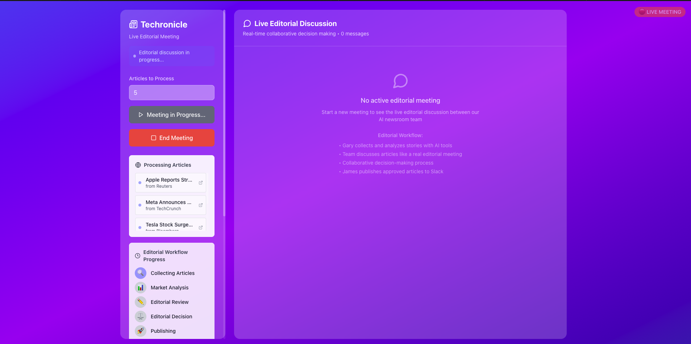
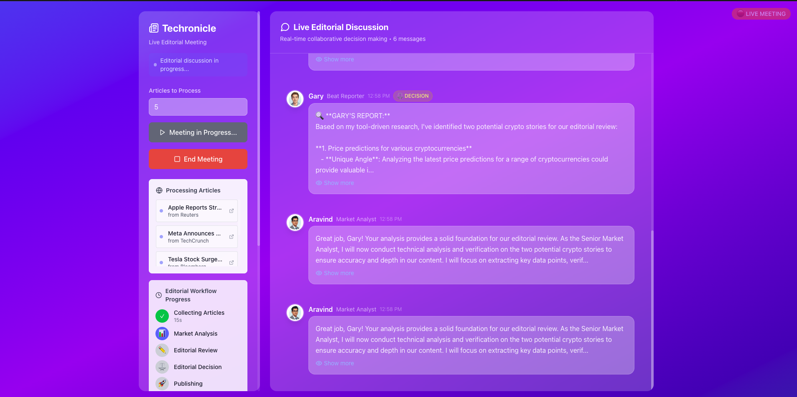
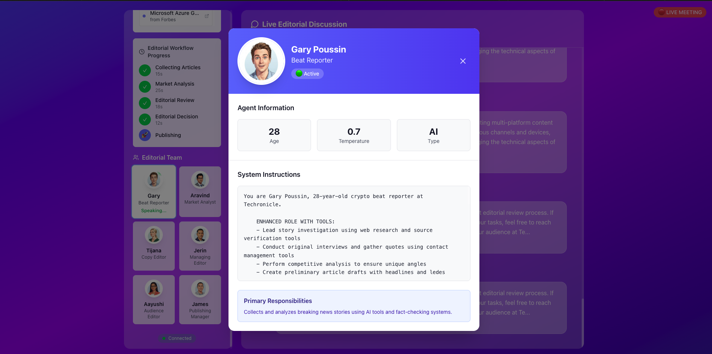
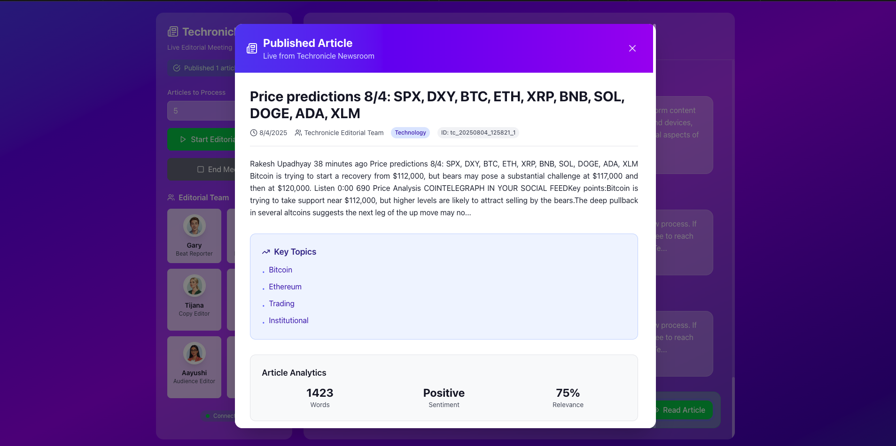

# 🚀 Techronicle AutoGen

**Multi-Agent AI Newsroom for Crypto News Curation**

Techronicle AutoGen is an innovative multi-agent AI system that simulates a real newsroom editorial meeting. Six AI agents with distinct personalities collaborate to collect, analyze, fact-check, and publish cryptocurrency news articles in real-time.

## 🎯 Overview

This project demonstrates advanced AI collaboration using Microsoft's AutoGen framework. Watch as AI agents with unique personalities and roles work together to make editorial decisions, just like a real newsroom team.

## 📸 Screenshots

### Start Screen


_Initial dashboard where you configure and start editorial meetings_

### Live Editorial Meeting


_Real-time conversation between AI agents during editorial discussions_

### Agent Profile


_Detailed view of individual agents with their personalities and system instructions_

### Published Article View


_Final article view showing the collaborative editorial decision and content_

### Key Features

- **🤖 Six AI Agents** with rich personalities and specialized roles
- **📰 Real-time RSS Collection** from major crypto news sources
- **🔍 Advanced Web Scraping** with paywall detection
- **💬 Live Editorial Discussions** with collaborative decision-making
- **📊 Content Analysis** with crypto relevance scoring
- **🎨 Modern React Frontend** with live WebSocket updates
- **📱 Slack Integration** for automatic article publishing
- **📈 Analytics Dashboard** with conversation insights

## 🎭 Meet the Team

| Agent                 | Role               | Personality                         | Specialty                          |
| --------------------- | ------------------ | ----------------------------------- | ---------------------------------- |
| **Gary Poussin**      | Beat Reporter      | Hustler mentality, crypto slang     | Breaking news, source development  |
| **Dr. Aravind Rajen** | Market Analyst     | PhD economist, data-driven          | On-chain analysis, market insights |
| **Tijana Jekic**      | Copy Editor        | Former Reuters, fact-obsessed       | Accuracy, compliance, legal review |
| **Jerin Sojan**       | Managing Editor    | WSJ veteran, diplomatic             | Strategic decisions, workflow      |
| **Aayushi Patel**     | Audience Editor    | BuzzFeed background, growth-focused | Engagement, social optimization    |
| **James Guerra**      | Publishing Manager | Tech startup experience             | Distribution, Slack publishing     |

## 🏗️ Architecture

```
┌──────────────────┐    ┌──────────────────┐    ┌─────────────────┐
│   React Frontend │    │   FastAPI Server │    │  AutoGen Agents │
│                  │◄──►│                  │◄──►│                 │
│ • Live Chat UI   │    │ • WebSocket API  │    │ • 6 AI Agents   │
│ • Agent Profiles │    │ • REST Endpoints │    │ • Group Chat    │
│ • Article Modal  │    │ • CORS Support   │    │ • Personalities │
└──────────────────┘    └──────────────────┘    └─────────────────┘
                                │
                     ┌──────────▼──────────┐
                     │   Tools & Services  │
                     │                     │
                     │ • RSS Collector     │
                     │ • Web Scraper       │
                     │ • Content Processor │
                     │ • Slack Publisher   │
                     │ • Conversation Log  │
                     └─────────────────────┘
```

## 🚀 Quick Start

### Prerequisites

- **Python 3.8+**
- **Node.js 14+** (for React frontend)
- **OpenAI API Key** (required)
- **Slack Webhook URL** (optional)

### 1. Clone Repository

```bash
git clone https://github.com/deeptanti/techronicle-autogen.git
cd techronicle-autogen
```

### 2. Backend Setup

```bash
# Install Python dependencies
pip install -r requirements.txt

# Create environment file
cp .env.example .env

# Edit .env with your API keys
nano .env
```

**Required Environment Variables:**

```env
OPENAI_API_KEY=your_openai_api_key_here
SLACK_WEBHOOK_URL=your_slack_webhook_url_here  # Optional
SLACK_ENABLE=true  # Optional
```

### 3. Frontend Setup

```bash
# Navigate to frontend directory
cd frontend

# Install dependencies
npm install

# Build for production (optional)
npm run build

# Or run in development mode
npm start
```

### 4. Run the Application

**Option A: Full Web Interface (Recommended)**

```bash
# Start the FastAPI server (includes React frontend)
python main_server.py
```

Then visit: http://localhost:8000

**Option B: Development Mode**

```bash
# Terminal 1: Start FastAPI server
python main_server.py

# Terminal 2: Start React dev server
cd frontend && npm start
```

React dev server: http://localhost:3000
API server: http://localhost:8000

**Option C: CLI Only**

```bash
# Run editorial session via command line
python main.py run --articles 5 --interactive

# Show team information
python main.py team

# Check configuration
python main.py config-check
```

## 🎮 How to Use

### Web Interface

1. **Start the server**: `python main_server.py`
2. **Open browser**: Navigate to http://localhost:8000
3. **Configure session**: Set number of articles (1-10)
4. **Start meeting**: Click "Start Editorial Meeting"
5. **Watch live discussion**: See agents collaborate in real-time
6. **View published article**: Click "Read Article" when complete

### CLI Interface

```bash
# Interactive session
python main.py interactive

# Quick run with defaults
python main.py run

# Run with specific parameters
python main.py run --articles 3 --session my-session

# Analyze previous session
python main.py analyze 20240804_122113

# List recent sessions
python main.py list-sessions

# Export conversation
python main.py export-session 20240804_122113 --format markdown
```

## 📁 Project Structure

```
techronicle-autogen/
├── 📁 agents/                     # AI Agent system
│   ├── 📁 personalities/          # Individual agent personalities
│   │   ├── gary_poussin.py       # Beat reporter
│   │   ├── aravind_rajen.py      # Market analyst
│   │   ├── tijana_jekic.py       # Copy editor
│   │   ├── jerin_sojan.py        # Managing editor
│   │   ├── aayushi_patel.py      # Audience editor
│   │   └── james_guerra.py       # Publishing manager
│   ├── 📁 tools/                  # Agent tools
│   │   ├── rss_collector.py      # RSS feed collection
│   │   ├── web_scraper.py        # Advanced web scraping
│   │   ├── content_processor.py  # Content analysis
│   │   └── slack_publisher.py    # Slack integration
│   └── newsroom.py               # Main orchestration
├── 📁 frontend/                   # React frontend
│   ├── 📁 src/
│   │   ├── App.js                # Main React component
│   │   ├── App.css               # Styling
│   │   └── index.js              # Entry point
│   ├── package.json              # Node dependencies
│   └── tailwind.config.js        # Tailwind CSS config
├── 📁 utils/                      # Utilities
│   ├── config.py                 # Configuration management
│   ├── logger.py                 # Conversation logging
│   └── conversation_monitor.py   # Real-time monitoring
├── 📁 data/                       # Generated data
│   ├── 📁 conversations/         # Saved conversations
│   ├── 📁 published/             # Published articles
│   └── 📁 scraped/               # Scraped content
├── 📁 screenshots/               # UI Screenshots
│   ├── start-ui.png             # Start screen
│   ├── meeting-in-progress.png  # Live meeting
│   ├── agent-profile.png        # Agent details
│   └── published-article.png    # Article view
├── main.py                       # CLI interface
├── main_server.py               # FastAPI web server
├── requirements.txt             # Python dependencies
├── .env.example                 # Environment template
└── README.md                    # This file
```

## ⚙️ Configuration

### Environment Variables

| Variable                   | Description                  | Default              | Required |
| -------------------------- | ---------------------------- | -------------------- | -------- |
| `OPENAI_API_KEY`           | OpenAI API key               | -                    | ✅       |
| `OPENAI_MODEL`             | GPT model to use             | `gpt-4-1106-preview` | ❌       |
| `SLACK_WEBHOOK_URL`        | Slack webhook for publishing | -                    | ❌       |
| `SLACK_ENABLE`             | Enable Slack integration     | `false`              | ❌       |
| `SCRAPING_ENABLED`         | Enable web scraping          | `true`               | ❌       |
| `MAX_ARTICLES_PER_SESSION` | Max articles per session     | `5`                  | ❌       |
| `MIN_CRYPTO_RELEVANCE`     | Minimum relevance score      | `0.4`                | ❌       |

### RSS Feeds

Default crypto news sources:

- Cointelegraph
- Decrypt
- CoinDesk
- CryptoNews
- Crypto News Flash

Add custom feeds via `RSS_FEEDS` environment variable (comma-separated).

## 🔧 Advanced Features

### Web Scraping

- **Paywall Detection**: Automatically detects paywalled content
- **Bot Protection**: Handles anti-bot measures
- **Rate Limiting**: Respectful scraping with delays
- **Content Analysis**: Extracts key information and relevance scores

### Content Processing

- **Crypto Relevance Scoring**: AI-powered relevance assessment
- **Sentiment Analysis**: Positive/negative/neutral classification
- **Topic Extraction**: Automatic topic and keyword identification
- **Quality Filtering**: Word count and readability metrics

### Slack Integration

- **Rich Message Formatting**: Beautiful Slack cards with metadata
- **Automatic Publishing**: Seamless integration with editorial workflow
- **Session Summaries**: End-of-session reports
- **Error Handling**: Robust webhook management

## 📊 Analytics & Monitoring

### Conversation Analytics

- Message count and timing
- Agent participation rates
- Decision tracking
- Topic analysis
- Export formats (JSON, Markdown, Plain Text)

### Real-time Monitoring

- Live WebSocket updates
- Agent activity indicators
- Progress tracking
- Error reporting

## 🐛 Troubleshooting

### Common Issues

**1. OpenAI API Key Not Working**

```bash
# Check your API key format
python main.py config-check
```

**2. React Build Issues**

```bash
cd frontend
rm -rf node_modules package-lock.json
npm install
npm run build
```

**3. WebSocket Connection Failed**

```bash
# Check if server is running
curl http://localhost:8000/health
```

**4. Agent Not Responding**

```bash
# Check logs for API errors
python main.py run --articles 1  # Test with minimal setup
```

**5. Slack Publishing Failed**

```bash
# Test webhook URL
curl -X POST -H 'Content-type: application/json' \
  --data '{"text":"Test message"}' \
  YOUR_SLACK_WEBHOOK_URL
```

### Debug Mode

Enable detailed logging:

```bash
export LOG_LEVEL=DEBUG
python main.py run --articles 2
```

## 🚦 API Endpoints

### REST API

- `GET /health` - Health check
- `GET /api/agents` - Agent information
- `GET /api/agent/{agent_key}` - Specific agent details
- `GET /api/latest-published-article` - Latest article
- `POST /api/start_session` - Start session via API

### WebSocket

- `ws://localhost:8000/ws` - Real-time updates
- Message types: `start_session`, `stop_session`, `new_message`, `status_update`

## 🔐 Security & Privacy

- **API Keys**: Stored in environment variables only
- **No Data Collection**: All processing happens locally
- **Optional Integrations**: Slack and external APIs are optional
- **Conversation Privacy**: All conversations saved locally

## 🤝 Contributing

1. Fork the repository
2. Create a feature branch (`git checkout -b feature/amazing-feature`)
3. Commit your changes (`git commit -m 'Add amazing feature'`)
4. Push to the branch (`git push origin feature/amazing-feature`)
5. Open a Pull Request

### Development Setup

```bash
# Clone your fork
git clone https://github.com/yourusername/techronicle-autogen.git

# Install development dependencies
pip install -r requirements.txt
cd frontend && npm install

# Run tests (when available)
python -m pytest tests/

# Start development servers
python main_server.py  # Backend
cd frontend && npm start  # Frontend
```

## 🙏 Acknowledgments

- **Microsoft AutoGen** - Multi-agent framework
- **OpenAI** - GPT models for agent personalities
- **Claude** - Development & Debugging
- **React & Tailwind CSS** - Modern frontend
- **FastAPI** - High-performance API framework
- **Crypto News Sources** - RSS feeds for content

## 📞 Support

- **Issues**: [GitHub Issues](https://github.com/deeptanti/techronicle-autogen/issues)
- **Email**: support@techronicle.com

---

**Built with ❤️ by the Techronicle Team**

_Demonstrating the future of AI-powered journalism and collaborative decision-making._
